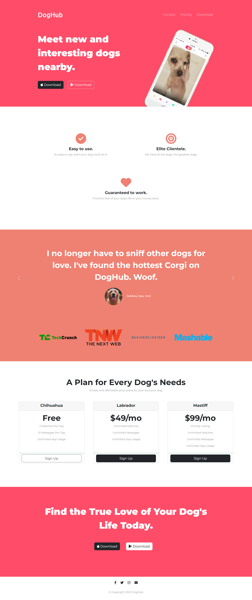

# Sample Responsive Website

This repository contains a product landing page built using HTML, CSS, and Bootstrap. The landing page is designed to showcase and promote a specific product, providing information, features, and a call to action for potential customers. It is a responsive website which is designed to adapt and display properly on various devices and screen sizes.

## Features

This website includes the following features:

* **Responsive Design:** The landing page is designed to be fully responsive, ensuring optimal viewing experience across different devices and screen sizes.
* **Bootstrap Framework:** The page utilizes the Bootstrap framework to enhance its layout, responsiveness, and overall user experience. It incorporates Bootstrap's grid system, components, and utilities.
* **Modern and Clean Design:** The landing page features a modern and clean design aesthetic, with attention to typography, color scheme, and visual elements to create an appealing user interface.
* **Information and Features:** The page includes sections to highlight the key features and benefits of the product, providing potential customers with a clear understanding of its value proposition.
* **Call to Action:** A prominent call to action section is included, encouraging visitors to take the desired action, such as signing up, making a purchase, or getting in touch.

## Technologies Used

The website is built using the following technologies:

* **HTML:** The landing page structure and content are created using HTML (Hypertext Markup Language). HTML provides the basic building blocks and elements for constructing web pages.
* **CSS:** Cascading Style Sheets (CSS) is used to define the visual appearance and styling of the landing page. CSS is responsible for layout, colors, typography, and other design aspects.
* **Bootstrap:** The landing page utilizes the Bootstrap framework, which is a popular CSS framework that provides a responsive grid system, pre-styled components, and a variety of utilities. Bootstrap simplifies the development process and ensures consistent styling across different devices.
* **Font Awesome:** Font Awesome is a popular icon library that offers a wide range of scalable vector icons. It has been used to enhance the visual presentation of the landing page by adding icons to various elements.
* **Google Fonts:** Google Fonts provides a collection of free, open-source fonts that has been integrated into this project. It allows for the customization of typography on the landing page by providing a diverse selection of font styles.

## 🛠 Installation and Setup Instructions

1. git clone https://github.com/tawfik575/sample-responsive-website-2.git
2. cd sample-responsive-website-2
3. start index.html

## Contributing

This is a sample project and contributions are not necessary. However, if you would like to contribute to the project, please fork the repository and submit a pull request.

## License

This project is licensed under the MIT License. Feel free to use, modify, and distribute the code as per the terms of the license.

## Contact

If you have any questions, suggestions, or feedback about the project, feel free to contact me at `tawfikbsmrstucse@gmail.com`.